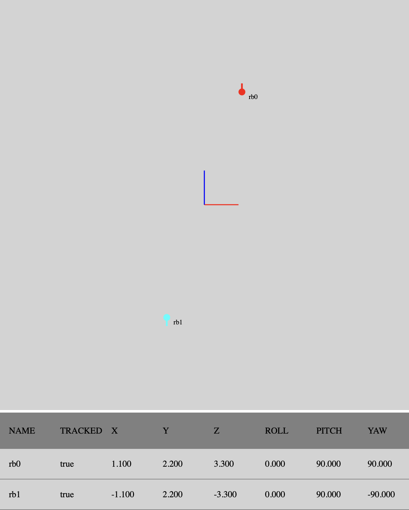

===========
Executables
===========

The package contains two helper script to interact with the NatNet server

Discover
========

Discover NatNet server in the local network

.. argparse::
   :module: natnet_py.natnet_discover
   :func: parser
   :prog: natnet_discover

Example
~~~~~~~

.. code-block:: console

   $ natnet_discover       
   ------------------------------------------------------------
   127.0.0.1:1510
       python_natnet server using NatNet version 3.1.0.0
       unicast data stream on :1511
   ------------------------------------------------------------

Interactive shell 
=================

Interact with NatNet servers

.. argparse::
   :module: natnet_py.natnet_cli
   :func: parser
   :prog: natnet_cli

Example
~~~~~~~

.. code-block:: console

   $ natnet_cli

   NatNet Client CLI. Type help or ? to list commands.

   (natnet) help

   Documented commands (type help <topic>):
   ========================================
   connect  data  delay  describe  disconnect  discover  help  log_level  quit
 
   (natnet) log_level INFO

   (natnet) connect 127.0.0.1

   [...] INFO: Connect  127.0.0.1
   [...] INFO: Creating command socket 0.0.0.0
   [...] INFO: Got description for rigid bodies: rb0, rb1
   [...] INFO: Start initial clock sync 0
   [...] INFO: Initial clock sync done: min_rtt 251000 ns, beta 0.0, delta ...
   [...] INFO: NatNet client connected to 127.0.0.1:1510
   [...] INFO: Creating data unicast socket on 0.0.0.0:1511

   (natnet) quit

   [...] INFO: Data socket closed
   [...] INFO: Command socket closed
   [...] INFO: Closed

GUI 
===

A very basic web-based 2D GUI to display MoCap updates

.. argparse::
   :module: natnet_py.natnet_gui
   :func: parser
   :prog: natnet_gui

It will open a web-browser where it draws rigid bodies on a map 
and display their poses in a table.

Example
~~~~~~~

.. code-block:: console

   $ natnet_gui

